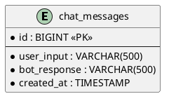
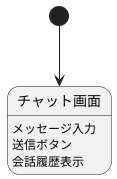

# チャットボットアプリケーション設計書

## 1. 概要

本ドキュメントは、シンプルなチャットボットアプリケーションの設計を記述します。ユーザーが名前を入力すると「こんにちは, ○○」と返信し、入力内容をデータベースに記録する機能を提供します。

## 2. 機能要件

### 2.1 チャット機能
- ユーザーが名前を入力すると「こんにちは, ○○」（○○は入力された名前）と返信する
- チャット形式のUIで会話履歴を表示する

### 2.2 データ記録機能
- ユーザーの入力内容をデータベースに記録する
- 記録する情報：入力内容、入力日時

## 3. システム構成

### 3.1 技術スタック
- フロントエンド: Vue3 + Element Plus + TypeScript
- バックエンド: Spring Boot 3.4
- データベース: H2 Database（組み込み、開発用）

### 3.2 ディレクトリ構成

```
chatbot-app/
├── frontend/          # Vue3フロントエンド
│   ├── src/
│   │   ├── components/
│   │   │   └── ChatBot.vue
│   │   ├── App.vue
│   │   └── main.ts
│   ├── package.json
│   └── vite.config.ts
└── backend/           # Spring Bootバックエンド
    ├── src/
    │   └── main/
    │       ├── java/
    │       │   └── com/chatbot/
    │       │       ├── ChatbotApplication.java
    │       │       ├── controller/
    │       │       │   └── ChatController.java
    │       │       ├── service/
    │       │       │   └── ChatService.java
    │       │       ├── repository/
    │       │       │   └── ChatMessageRepository.java
    │       │       └── entity/
    │       │           └── ChatMessage.java
    │       └── resources/
    │           └── application.yml
    └── pom.xml
```

## 4. データベース設計

### 4.1 ER図



### 4.2 テーブル定義

| カラム名 | データ型 | 制約 | 説明 |
|---------|---------|------|------|
| id | BIGINT | PRIMARY KEY, AUTO_INCREMENT | 主キー |
| user_input | VARCHAR(500) | NOT NULL | ユーザーの入力内容 |
| bot_response | VARCHAR(500) | NOT NULL | ボットの返信内容 |
| created_at | TIMESTAMP | NOT NULL | 作成日時 |

## 5. API設計

### 5.1 チャットメッセージ送信API

**エンドポイント**: `POST /api/chat`

**リクエスト**:
```json
{
  "message": "太郎"
}
```

**レスポンス**:
```json
{
  "id": 1,
  "userInput": "太郎",
  "botResponse": "こんにちは, 太郎",
  "createdAt": "2026-02-04T09:00:00"
}
```

### 5.2 チャット履歴取得API

**エンドポイント**: `GET /api/chat/history`

**レスポンス**:
```json
[
  {
    "id": 1,
    "userInput": "太郎",
    "botResponse": "こんにちは, 太郎",
    "createdAt": "2026-02-04T09:00:00"
  }
]
```

## 6. 画面設計

### 6.1 画面遷移図



### 6.2 画面レイアウト

チャット画面は以下の要素で構成されます：
- ヘッダー：アプリケーションタイトル「チャットボット」
- メッセージ表示エリア：会話履歴を時系列で表示
- 入力エリア：テキスト入力フィールドと送信ボタン

## 7. 実装方針

### 7.1 フロントエンド
- Vue3 Composition APIを使用
- Element Plusのコンポーネントを活用（el-input, el-button, el-card）
- axiosでバックエンドAPIと通信

### 7.2 バックエンド
- Spring Boot 3.4を使用
- Spring Data JPAでデータベースアクセス
- RESTful APIとして実装
- CORSを設定してフロントエンドからのアクセスを許可

### 7.3 データベース
- H2 Databaseを組み込みモードで使用
- Spring Data JPAのエンティティからテーブルを自動生成
